# 💻 Tutorial: Criando uma Máquina Virtual com Windows Server no Microsoft Azure

Este tutorial tem como objetivo orientar passo a passo a criação de uma máquina virtual (VM) com o sistema operacional **Windows Server** utilizando o portal do **Microsoft Azure**. Ideal para iniciantes e projetos acadêmicos.

---

## 📋 Pré-requisitos

Antes de começar, certifique-se de ter:

- Uma conta ativa no [Microsoft Azure](https://portal.azure.com/)
- Permissões para criar recursos (caso esteja em um ambiente corporativo ou educacional)
- Acesso à internet

---

## 🚀 Passo a Passo para Criar a VM no Azure

### 1. Acesse o portal do Azure

Acesse o site [https://portal.azure.com](https://portal.azure.com) e faça login com sua conta Microsoft.

---

### 2. Navegue até "Máquinas Virtuais"

No menu lateral esquerdo ou na barra de busca superior, digite e clique em **"Máquinas Virtuais"**.

---

### 3. Clique em "Criar" > "Máquina virtual"

Clique no botão **"Criar"**, depois selecione **"Máquina virtual"** para iniciar o assistente de criação.

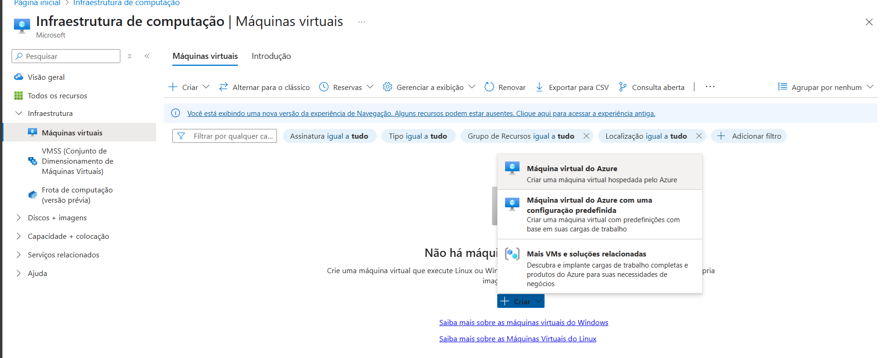

---

### 4. Aba **"Informações Básicas"**

Preencha os seguintes campos:

- **Assinatura**: escolha a assinatura válida.
- **Grupo de Recursos**: selecione um existente ou clique em **"Criar novo"**.
- **Nome da máquina virtual**: ex. `JeronimoDIOAzure`.
- **Região**: escolha a localização (ex: *Brazil South*).
- **Imagem**: selecione **Windows Server 2025 Datacenter - Gen2** ou outra versão desejada.
- **Tamanho da máquina**: clique em "Alterar tamanho" e escolha um plano como `Standard_B1s` para testes.
- **Usuário e senha**: crie um nome de usuário e senha fortes para acessar a VM.

> ⚠️ Importante: Guarde esses dados para login remoto (RDP).

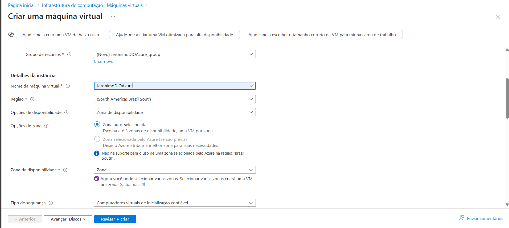

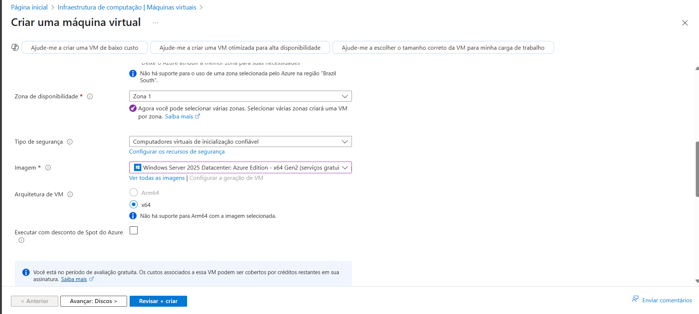

---

### 5. Aba **"Discos"**

- Escolha o tipo de disco do sistema operacional: **SSD padrão** é uma boa escolha para testes.
- Mantenha as demais opções como padrão.

---

### 6. Aba **"Rede"**

- A rede virtual, sub-rede e IP público serão criados automaticamente se você não tiver um ambiente existente.
- Em **Portas de entrada públicas**, marque **Permitir portas selecionadas**.
  - Selecione: **RDP (3389)**
  - Selecione: **HTTP (80)**

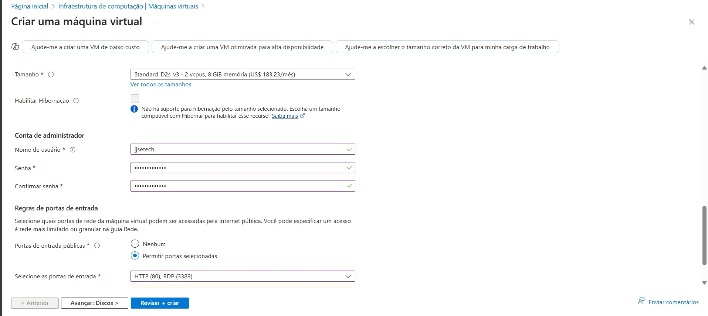

---

### 7. Aba **"Gerenciamento" (opcional)**

Você pode manter as configurações padrão, ou:

- Ativar desligamento automático para economizar créditos (útil em ambientes educacionais).

---

### 8. Aba **"Avançado" e "Tags"**

- Pode deixar essas abas com as opções padrão ou adicionar tags se desejar organizar os recursos.

---

### 9. Clique em **"Revisar + Criar"**

Revise as configurações. Se estiver tudo certo, clique em **"Criar"**. Aguarde alguns minutos até a implantação ser concluída.

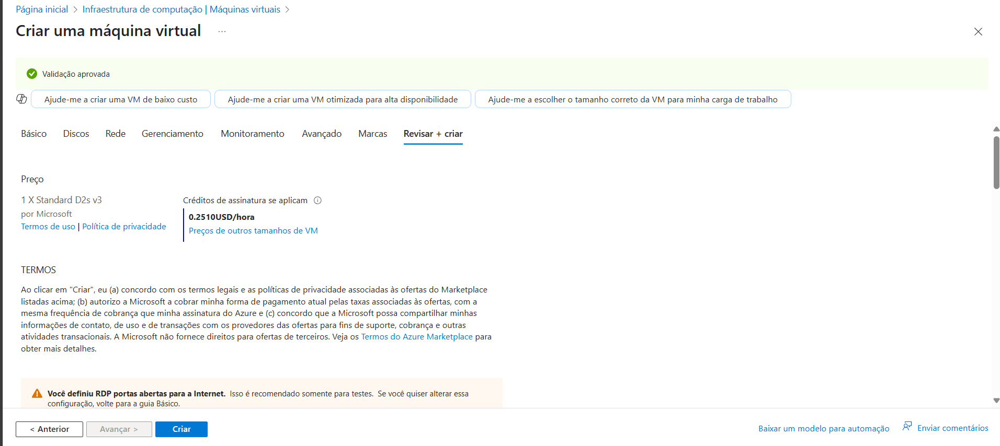

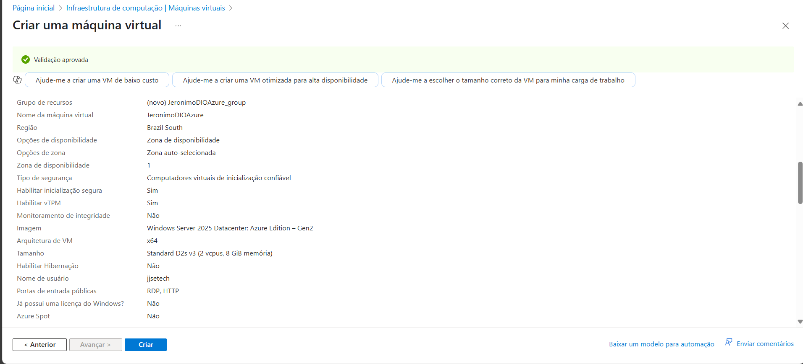

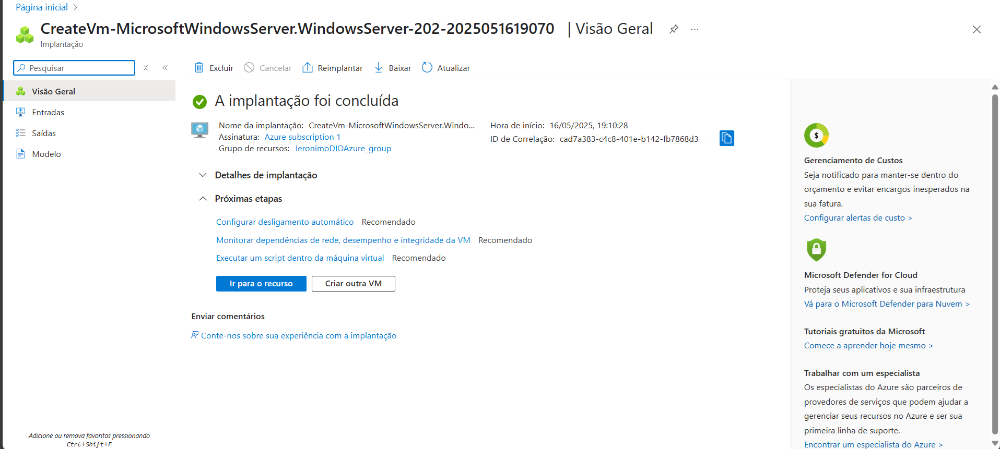

---

## 🔐 Acessando a Máquina Virtual

Após a criação:

1. Vá para **Máquinas Virtuais** no portal.
2. Clique na sua VM.
3. No menu superior, clique em **"Conectar" > "Área de Trabalho Remota (RDP)"**.
4. Baixe o arquivo `.rdp` e abra com o **Cliente de Conexão de Área de Trabalho Remota**.
5. Use o nome de usuário e senha que você criou para acessar.

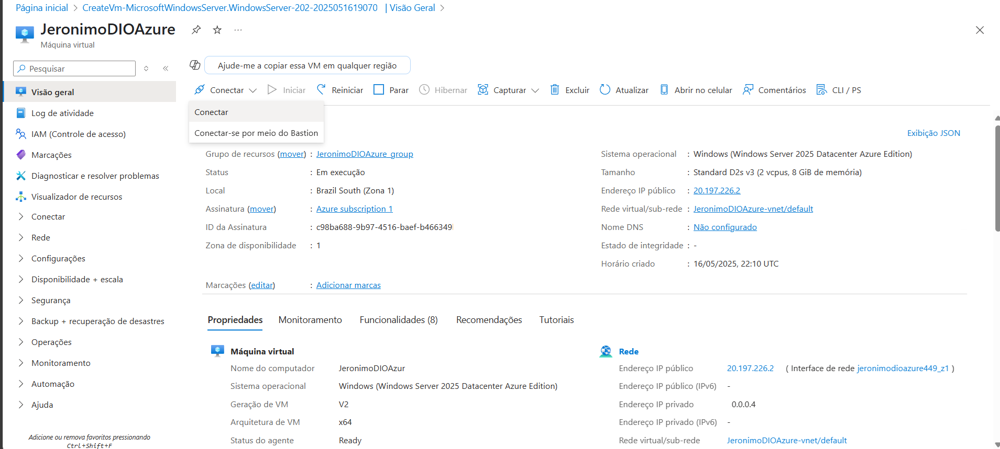

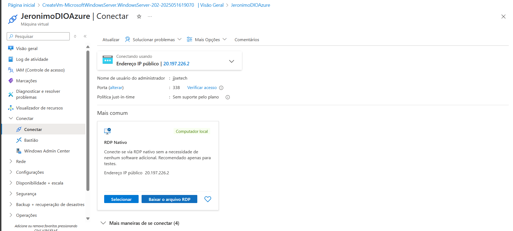

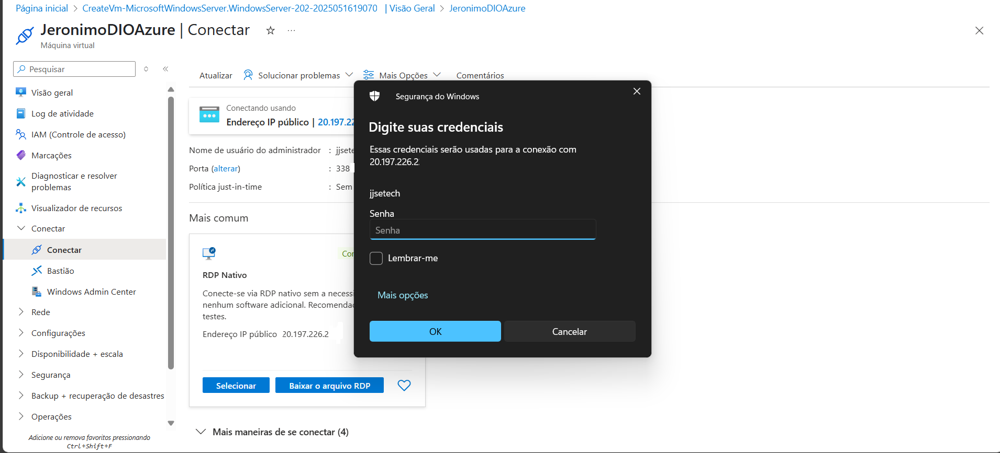

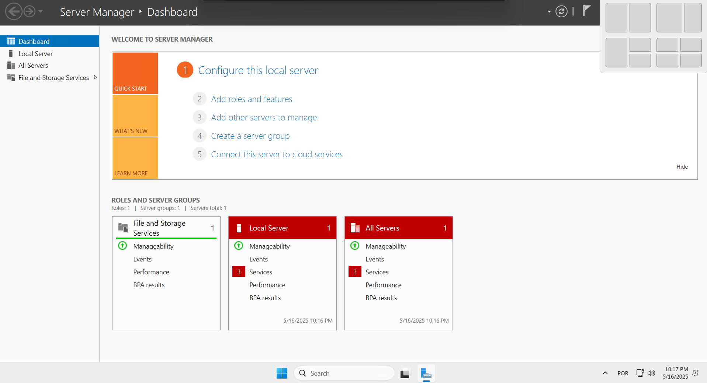

---

## 🧹 Dicas Importantes

- Lembre-se de **parar ou excluir a VM** após o uso para evitar cobranças indesejadas.
- Utilize **etiquetas (tags)** para organizar e gerenciar custos no portal do Azure.
- Sempre **proteja as credenciais** da sua VM.

---

## ✅ Conclusão

Com este tutorial, você aprendeu a criar uma máquina virtual com Windows Server no Microsoft Azure. Este processo é essencial para testes, treinamentos, e até mesmo para hospedar aplicações em ambientes reais.

---

## 📚 Referências

- [Documentação oficial do Azure - Máquinas Virtuais](https://learn.microsoft.com/pt-br/azure/virtual-machines/)
- [Microsoft Learn - Curso gratuito sobre Azure](https://learn.microsoft.com/pt-br/training/)

